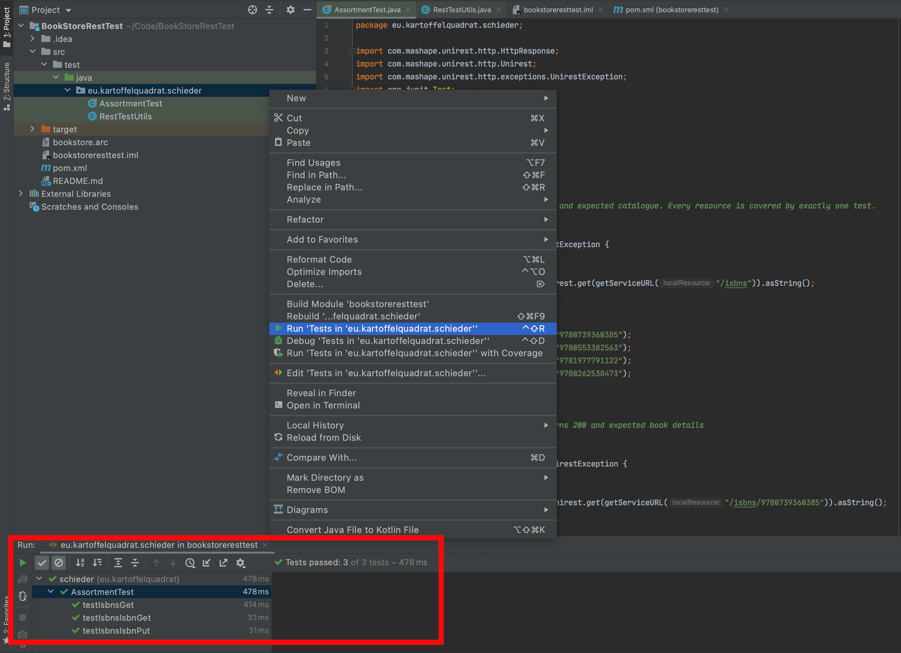

# Book Store REST Test

Unit Tests for the Book Store API

## About

The [Book Store](https://github.com/kartoffelquadrat/BookStoreInternals) is a test project for service RESTification.  
RESTification success can be measured by comparing the actual API behaviour to the interface specification.

 * This repository hosts unit tests for a systematic evaluation of the REST API correctness.
 * Every Resource+CRUD combination is covered by a dedicated test.
 * Running this test bundle tells you the correctness ratio of a given Book Store REST implementation.

## Usage

 * Clone this repo
 * Open it with IntelliJ
 * Run the tests, verify the success rate:



## MISC

 * There is one dedicated (```@Test``` annotated) unit test per REST endpoint (resource + CRUD operation)
 * All queries are realized with [UniRest](http://kong.github.io/unirest-java/)
 * Server replies are verified for containment of the status code "200/OK" in the header.
 * Queries modifying state (*Put* / *Post* / *Delete*)...
   * Do not operate on default data but on random isbn identifiers to avoid collisions / blemished state on test re-run.
   * Are followed by a subsequent *Get* request to verify the state change was correctly applied.
 * Queries containing a body payload (*Put* / *Post*) specify the body encoding with a header field: ```Content-Type: application/json```.

## Contact / Pull Requests

 * Author: Maximilian Schiedermeier 
 * Github: Kartoffelquadrat
 * Webpage: https://www.cs.mcgill.ca/~mschie3
 * License: [MIT](https://opensource.org/licenses/MIT)
